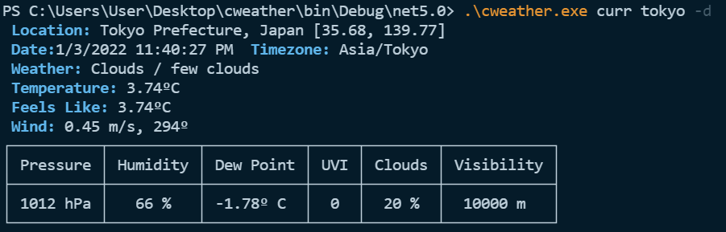

# cweather

A CLI application written in C# to see weather of a location.
It uses two API services to fetch data from:

1. OpenWeatherMap  : [One call API](https://openweathermap.org/api/one-call-api)
2. Mapbox : [Geocoding API](https://docs.mapbox.com/api/search/geocoding/)

OpenWeatherMap one call API requires latitude and longtitude to return a result. So, Mapbox geocoding API is used to forward geocode a location string to latitude and longitude.

To show results in the terminal using tables, fancy colors and to parse the command line arguments, [Spectre.Console](https://spectreconsole.net/) library was used.

## How to run
This project is built using .NET5.  So it is needed to properly run the application.

 1. Create an ```.env``` file like the provided example ```.env.example``` to add your own API tokens here. Otherwise program won't run.
 2. Clone the project
    ```
    git clone https://github.com/rak810/cweather.git
    ```
 3. Then cd into the project folder.
    ```
    cd .\cweather\
    ```
 4. Run build command 
    ```
    dotnet build
    ``` 
 5. The project will compile now. And run the exe from bin.
        
      ``` 
      cd .\bin\Debug\net5.0\ 
      .\cweather.exe --help
      ```

## Screenshots
### ```.\cweather.exe --help```

### ```.\cweather.exe curr [Location]```

### ```.\cweather.exe curr [Location] -d```

### ```.\cweather.exe fcast hourly [Location] -r [range]```

### ```.\cweather.exe fcast [Location] "louiseville kentucky" -i [idx]```


## Conclusion
The project isnt done yet completely. There are parts that need some more works. Things that are left to do:
 
 1. Add support for default location. A location that is saved. And if the location isn't specified in the commandline then results will be show for default location.  
 2. Add support for adding token through CLI.
 3. Add some charts to visualize daily and hourly forecast.